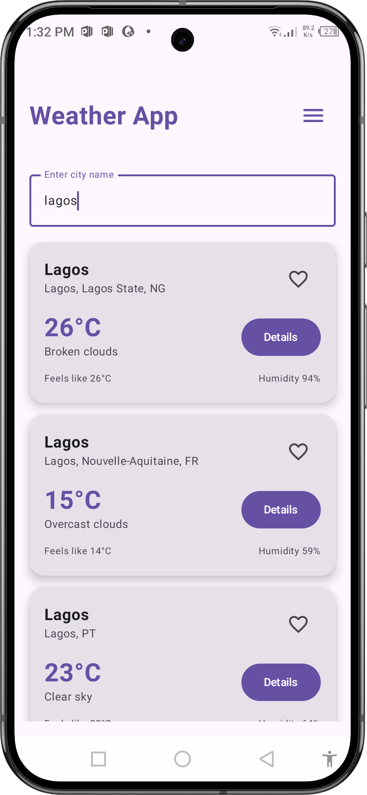

# Weather App

A modern Android weather application built with Jetpack Compose, following MVVM architecture and Clean Architecture principles.
## Features
- **Splash Screen**: Beautiful animated splash screen with smooth transition to home
- **Home Screen**: Search for weather by city name with favorite city functionality
- **Weather Detail Screen**: Comprehensive weather information display
- **Favorite City**: Save and automatically load your favorite city
- **Real-time Data**: Fetches current weather data from OpenWeather API
- **Offline Storage**: Persists user preferences using DataStore
## Screenshots
<details>
<summary>here</summary>
<table>
<tr>
<th></th>
<th></th>
<th></th>
</tr>

<tr>
<th>Splash Screen</th>
<th>Home Screen</th>
<th>City Detail</th>
</tr>

<tr>
<th></th>
<th></th>
<th></th>
</tr> 

<tr>
<th>Favourite List</th>
<th>City Details</th>
<th>Search Screen</th>
</tr>

</table>

</details>

## Architecture

This app follows **Clean Architecture** principles with **MVVM** pattern:

### Layers:
- **Presentation Layer**: UI (Jetpack Compose) + ViewModels
- **Domain Layer**: Use Cases + Repository Interfaces + Domain Models
- **Data Layer**: Repository Implementations + API Services + Data Models

### Key Components:
- **Dependency Injection**: Dagger Hilt
- **Navigation**: Navigation Compose
- **Networking**: Retrofit + OkHttp
- **Local Storage**: DataStore Preferences
- **Concurrency**: Kotlin Coroutines + Flow
- **Testing**: JUnit + MockK

## Setup Instructions

### 1. Build and Run

1. Clone the repository
2. Open in Android Studio
3. Sync project with Gradle files
4. Run the app on an emulator or physical device

## Project Structure

```
app/src/main/java/com/example/weather_app/
├── data/
│   ├── mapper/          # Data transformation
│   ├── model/           # API response models
│   ├── remote/          # API service
│   └── repository/      # Repository implementations
├── di/                  # Dependency injection modules
├── domain/
│   ├── model/           # Domain models
│   ├── repository/      # Repository interfaces
│   ├── usecase/         # Business logic use cases
│   └── util/            # Utility classes
├── presentation/
│   ├── home/            # Home screen
│   ├── navigation/      # Navigation setup
│   ├── splash/          # Splash screen
│   └── weather_detail/  # Weather detail screen
├── ui/theme/            # App theming
├── MainActivity.kt      # Main activity
└── WeatherApplication.kt # Application class
```

## Testing

Run tests using:
```bash
./gradlew test
```

Test coverage includes:
- **ViewModels**: State management and business logic
- **Repositories**: Data layer operations
- **Use Cases**: Business rules and validation
- **Domain Models**: Data transformations

## Technologies Used

- **Kotlin**: Programming language
- **Jetpack Compose**: Modern UI toolkit
- **Hilt**: Dependency injection
- **Retrofit**: HTTP client
- **Coroutines**: Asynchronous programming
- **Navigation Compose**: Navigation framework
- **DataStore**: Local data storage
- **ViewModel**: UI-related data holder
- **StateFlow**: Reactive state management
- **MockK**: Mocking framework for testing
- **JUnit**: Testing framework


